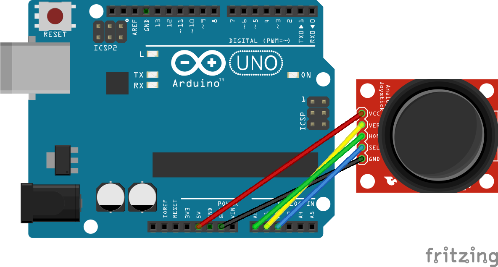

# Weeks 7 + 8 | Combining Arduino and Processing
[process.patrickjam.es/](https://process.patrickjam.es/2020/10/15/week-7-combining-arduino-and-processing/)

## Sketch 1: Piano


[](https://vimeo.com/468627192)


This week’s assignment explores serial communication between Arduino and Processing. The first sketch uses Processing to create an onscreen piano keyboard that plays tones on a piezo buzzer connected to the Arduino. The user can choose if a hover or click plays the tone. I found a [list of frequencies](https://pages.mtu.edu/~suits/notefreqs.html) for each note from MTU’s Physics of Music that I referenced. At first, I considered creating a JSON file that Processing would read to determine the key’s color, position, and frequency to send to Arduino. I quickly realized that this approach would not work since serial communication sends bytes while the frequencies are float values outside the range of -128 to 127. So, I worked with the following approach. Processing first creates the white keys as rectangles. Each key has a set width of 54 pixels — the window is 796 pixels wide with 14 white keys. Fourteen keys at 54 pixels wide combine to make the keyboard 756 pixels wide, giving 20 pixels of padding on each side. The first key begins with an x position of 20 pixels, and each consecutive key increases by the width, 54 pixels. The creation of these keys is controlled by a for loop:
```processing
int w = 54,
    h = 260,
    y = 20;

void draw() {
    int x = 20;

    for (int i = 0; i < 14; i++) {
        fill(255);

        rect(x, y, w, h);
        x += w;
    }
}
```

The creation of black keys is similar to that of the white keys. Each of the 10 black keys is half the white key’s width and height and sits on the edge between two white keys. The y position is still 20 pixels, but the first x position is three-fourths the width of a white key past the beginning of the keyboard. Each consecutive black key is one width of a white key down the keyboard; however, the third, sixth, and eighth keys have an extra gap before them. This for loop immediately follows the above for loop:

```processing
x = 20 + w * 3/4;
for (int i = 0; i < 10; i++) {
    fill(0);

    if (i ==2 || i == 5 || i == 7) {
        x += w;
    }
    rect(x, y, w/2, h/2);
    x += w;
}
```

The user also controls the play mode — hover or click. The text for these modes uses draws text to the screen once the rectangles are created. A variable, mode, holds the name of the current mode as a string.

```processing
fill(0);
text("play tone on: ", 20, 320);
if (mode == "hover") {
    text("click", 210, 320);
    fill(#80ADA0);
    text("hover", 150, 320);
} else {
    text("hover", 150, 320);
    fill(#80ADA0);
    text("click", 210, 320);
}
```

To change between the two play modes, mouseClicked() is used to check if the mouse is over a mode name on a click.

```processing
void mouseClicked() {
    if ((mouseX >= 150) && (mouseX <= 220) && (mouseY >= 300)) {
        mode = "hover";
    } else if ((mouseX >= 210) && (mouseX <= 250) && (mouseY >= 300)) {
        mode = "click";
    }
}
```

The user’s mouse controls the communication from Processing to Arduino in a function, mouseOverKey(), that uses mouseX and mouseY to determine if the mouse is over a key. Since I need to know which key is being hovered in both Processing and Arduino, mouseOverKey() returns an integer. If the mouse is outside the keyboard, the function returns -1. If the mouse is over a black key, the function returns an integer from 100 to 109. This integer is 100 more than the i value in the for loop that creates the key being hovered. If the mouse is over a white key, the function returns an integer from 0 to 13. This integer is identical to the i value in the for loop that creates the key being hovered. Checking for an out of bounds mouse or a black key hover comes before the check for a white key hover because if the mouse is inside the keyboard and not over a black key, it is over a white key, and we only need mouseX to determine which key. If the flow makes it all the way to the end of the if statements (it shouldn’t), the function returns -2.

```processing
int mouseOverKey() {
    if ((mouseX < 20) || (mouseX > 776) || (mouseY < 20) || (mouseY > 280)) {
        return -1;
    } else if ((mouseX >= w * 3/4 + 20) && (mouseX < 20 + w * 5/4) && (mouseY < 20 + h / 2)) { 
        return 100; 
    } else if ((mouseX >= w * 7/4 + 20) && (mouseX < 20 + w * 9/4) && (mouseY < 20 + h / 2)) { 
        return 101; 
    } else if ((mouseX >= w * 15/4 + 20) && (mouseX < 20 + w * 17/4) && (mouseY < 20 + h / 2)) { 
        return 102; 
    } else if ((mouseX >= w * 19/4 + 20) && (mouseX < 20 + w * 21/4) && (mouseY < 20 + h / 2)) { 
        return 103; 
    } else if ((mouseX >= w * 23/4 + 20) && (mouseX < 20 + w * 25/4) && (mouseY < 20 + h / 2)) { 
        return 104; 
    } else if ((mouseX >= w * 31/4 + 20) && (mouseX < 20 + w * 33/4) && (mouseY < 20 + h / 2)) { 
        return 105; 
    } else if ((mouseX >= w * 35/4 + 20) && (mouseX < 20 + w * 37/4) && (mouseY < 20 + h / 2)) { 
        return 106; 
    } else if ((mouseX >= w * 43/4 + 20) && (mouseX < 20 + w * 45/4) && (mouseY < 20 + h / 2)) { 
        return 107;
    } else if ((mouseX >= w * 47/4 + 20) && (mouseX < 20 + w * 49/4) && (mouseY < 20 + h / 2)) { 
        return 108; 
    } else if ((mouseX >= w * 51/4 + 20) && (mouseX < 20 + w * 53/4) && (mouseY < 20 + h / 2)) { 
        return 109; 
    } else if ((mouseX < w + 20)) { 
        return 0; 
    } else if ((mouseX >= w + 20) && (mouseX < 20 + w * 2)) { 
        return 1; 
    } else if ((mouseX >= 2 * w + 20) && (mouseX < 20 + w * 3)) { 
        return 2; 
    } else if ((mouseX >= 3 * w + 20) && (mouseX < 20 + w * 4)) { 
        return 3; 
    } else if ((mouseX >= 4 * w + 20) && (mouseX < 20 + w * 5)) { 
        return 4; 
    } else if ((mouseX >= 5 * w + 20) && (mouseX < 20 + w * 6)) { 
        return 5; 
    } else if ((mouseX >= 6 * w + 20) && (mouseX < 20 + w * 7)) { 
        return 6; 
    } else if ((mouseX >= 7 * w + 20) && (mouseX < 20 + w * 8)) { 
        return 7; 
    } else if ((mouseX >= 8 * w + 20) && (mouseX < 20 + w * 9)) { 
        return 8; 
    } else if ((mouseX >= 9 * w + 20) && (mouseX < 20 + w * 10)) { 
        return 9; 
    } else if ((mouseX >= 10 * w + 20) && (mouseX < 20 + w * 11)) { 
        return 10; 
    } else if ((mouseX >= 11 * w + 20) && (mouseX < 20 + w * 12)) { 
        return 11; 
    } else if ((mouseX >= 12 * w + 20) && (mouseX < 20 + w * 13)) { 
        return 12; 
    } else if ((mouseX >= 13 * w + 20) && (mouseX < 20 + w * 14)) {
        return 13;
    } else {
        return -2;
    }
}
```

These integers are used in the for loops creating the keys as seen below. A function, playTone(), is called with an integer parameter to update the fill of the key, send the value to Arduino, and change a boolean, playing, to true. This boolean is true while a tone is playing and is changed to false when the mouse is released in click mode or when the mouse is moved outside the keyboard in hover mode. Once this is false, -1 is sent to Arduino to call noTone().

```processing
fill(255);
if ((mouseOverKey() == i) && (((mode == "click") && (mousePressed)) || (mode == "hover"))) {
    playTone(i);
}

// ... 

fill(0);
if ((mouseOverKey() == i + 100) && (((mode == "click") && (mousePressed)) || (mode == "hover"))) {
    playTone(i + 100);
}

// ...

if (mouseOverKey() < 0) {
    playing = true;
}

if (!playing) {
    myPort.write(-1);
}

// ...
// ...

void playTone(int i) {
    fill(50);
    myPort.write(i);
    playing = true;
}

// ...

void mouseReleased() {
    if ((mode == "click") && playing) {
        playing = false;
    }
}
```

Moving to Arduino, this sketch uses a piezo buzzer on pin 9. With Serial.begin(9600) in setup(), the loop() function is able to read the integers written by Processing. These are used in a switch statement that matches the integer to the correct [frequency](https://pages.mtu.edu/~suits/notefreqs.html), or 0 if a tone should stop playing.

```c++
float freq;

void loop() {
    while (Serial.available()) {
        switch (Serial.read()) {
            case 0:
                freq = 130.81;
            case 1:
                freq = 146.83;
            case 2:
                freq = 164.81;
            case 3:
                freq = 174.61;
            case 4:
                freq = 196.00;
            case 5:
                freq = 220.00;
            case 6:
                freq = 246.94;
            case 7:
                freq = 261.63;
            case 8:
                freq = 293.66;
            case 9:
                freq = 329.63;
            case 10:
                freq = 349.23;
            case 11:
                freq = 392.00;
            case 12:
                freq = 440.00;
            case 13:
                freq = 493.88;
            case 100:
                freq = 138.59;
            case 101:
                freq = 155.56;
            case 102:
                freq = 185.00;
            case 103:
                freq = 207.65;
            case 104:
                freq = 233.08;
            case 105:
                freq = 277.18;
            case 106:
                freq = 311.13;
            case 107:
                freq = 369.99;
            case 108:
                freq = 415.30;
            case 109:
                free = 466.16;
            default:
                freq = 0;
        }
        if (freq > 0) {
            tone(9, freq);
        } else {
            noTone(9);
        }
    }
}
```
## Sketch 2: Etch a Sketch



The second sketch of this week sends joystick input from Arduino to Processing. This input controls a circle shape on the screen to draw using the joystick’s position to control speed and direction. Pressing the joystick down clears the screen and changes the background and fill colors. The joystick is powered by the 5V pin on the Arduino and connected to A0, A1, and A2 to send the x, y, and button data, respectively. On a button press, there is a slight delay to debounce. The loop() function writes a single space delimited line on each iteration.

```c++
Serial.print(analogRead(A0));
Serial.print(' ');
Serial.print(analogRead(A1));
Serial.print(' ');
Serial.println(analogRead(A2));

if(analogRead(A2) == 0) {
    delay(300);
}
```

Processing uses bufferUntil(‘\n’) to wait for a complete line of data. serialEvent() controls the data from Arduino by trimming and converting to floats, then mapping to a value between -10 and 10. My joystick’s rest position was a little bit off of center, but the bounds were still reading 0 and 1023. The resting x read 526 and resting y read 504. Subtracting 14.5 from x and adding 7.5 to y brings the values to center.

The background and fill colors are stored in two arrays, bgColors and fillColors. The joystick press changes a boolean, bDown, to true, which will make the draw loop call background(bgColors[colorIndex]) then reset the boolean to false before continuing to sketch. This press also increases the color index by 1.

```processing
color[] bgColors = {color(38, 70, 83), color(42, 157, 143), color(233, 196, 106), color(244, 167, 97), color(55, 55, 31)};

color[] fillColors = {color(64, 118, 140), color(78, 208, 193), color(244, 227, 184), color(250, 211, 179), color(118, 118, 66)};

int colorIndex = 0;

float xSpeed = 0,
      ySpeed = 0;
boolean bDown = false;

void serialEvent(Serial myPort) {
    String xString = myPort.readStringUntil(' ');
    String yString = myPort.readStringUntil(' ');
    String bString = myPort.readStringUntil('\n');

    if (xString != null && yString != null && bString != null) {
        xString = trim(xString);
        yString = trim(yString);
        bString = trim(bString);
    }

    xSpeed = float(xString) - 14.5;
    ySpeed = float(yString) + 7.5;
    
    xSpeed = map(xSpeed, 0, 1023, -10, 10);
    ySpeed = map(ySpeed, 0, 1023, -10, 10);

    if(float(bString) == 0) {
        colorIndex++;
        bDown = true;
        if (colorIndex > 4) {
            colorIndex = 0;
        }
    }
}
```

To draw following the joystick input, the draw() loop draws circles without resetting the background and incrementing the x and y positions by the speed variables provided by serialEvent(). Two if/else statements inhibit the shape from moving outside the 800 pixel square window.

```processing
float xPos = 400,
      yPos = 400;

void draw() {
    if (bDown) {
        background(bgColors[colorIndex]);
        bDown = false;
    }

    fill(fillColors[colorIndex]);
    noStroke();

    circle(xPos, yPos, 20);

    xPos += xSpeed;
    yPos += ySpeed;

    if (xPos > 800) {
        xPos = 800;
    } else if (xPos < 0) {
        xPos = 0;
    }

    if (yPos > 800) { 
        yPos = 800;
    } else if (yPos < 0) {
        yPos = 0;
    }
}
```
