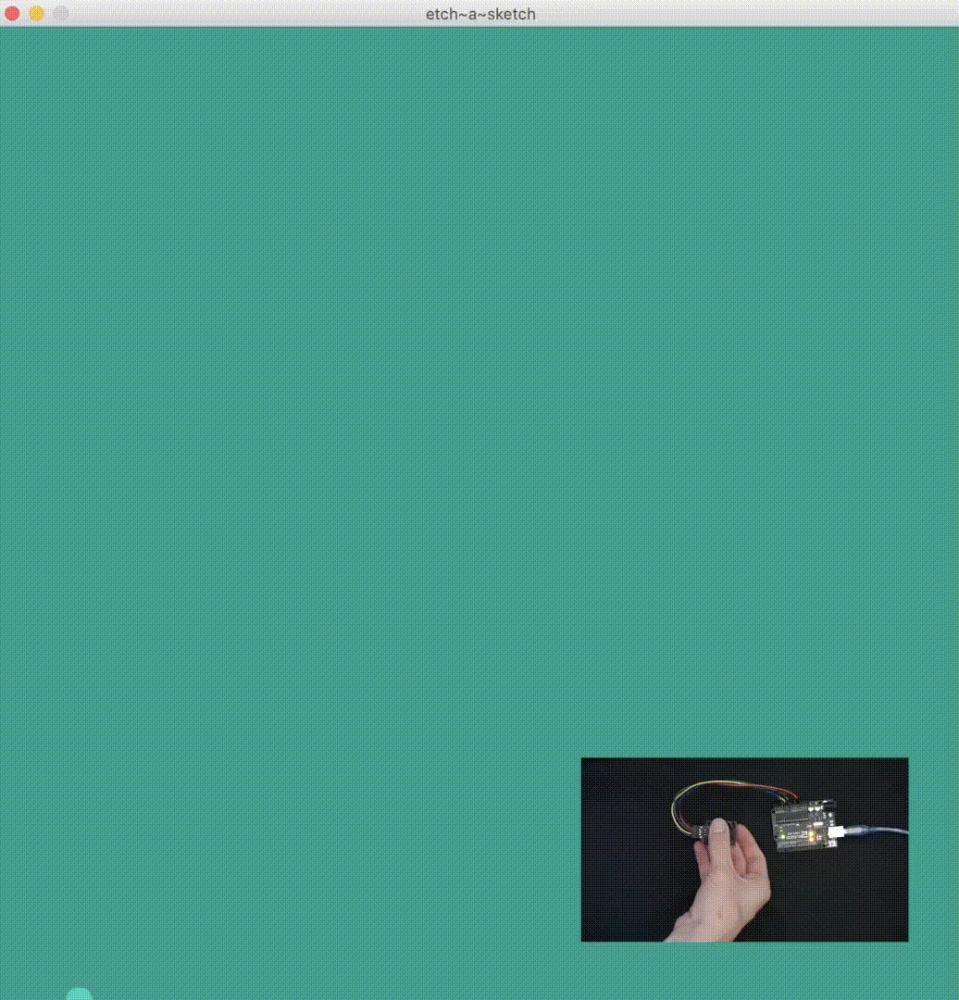
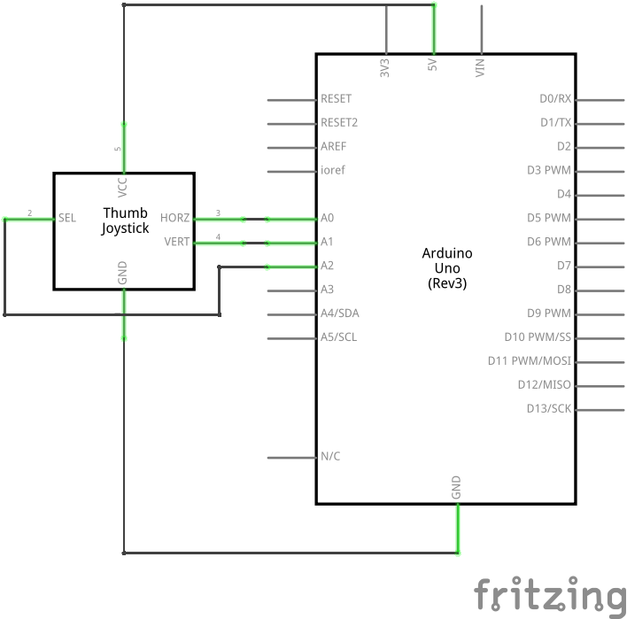

# Sketch 2: Etch a Sketch

[process.patrickjam.es/](https://process.patrickjam.es/2020/10/15/week-7-combining-arduino-and-processing/)

Processing:
```processing

import processing.serial.*;

Serial myPort;

color[] bgColors = {color(38, 70, 83), color(42, 157, 143), color(233, 196, 106), color(244, 167, 97), color(55, 55, 31)};
color[] fillColors = {color(64, 118, 140), color(78, 208, 193), color(244, 227, 184), color(250, 211, 179), color(118, 118, 66)};
int colorIndex = 0;

float xSpeed = 0, 
  ySpeed = 0, 
  xPos = 400, 
  yPos = 400;

boolean bDown = false;

void setup () {
  size(800, 800);

  myPort = new Serial(this, Serial.list()[2], 9600);
  myPort.bufferUntil('\n');

  background(bgColors[colorIndex]);
  surface.setTitle("etch~a~sketch");
}

void draw () {
  if (bDown) {
    background(bgColors[colorIndex]);
    bDown = false;
  }
  fill(fillColors[colorIndex]);
  noStroke();
  circle(xPos, yPos, 20);
  xPos += xSpeed;
  yPos += ySpeed;

  if (xPos > 800) {
    xPos = 800;
  } else if (xPos < 0) {
    xPos = 0;
  }
  if (yPos > 800) {
    yPos = 800;
  } else if (yPos < 0) {
    yPos = 0;
  }
}
void serialEvent (Serial myPort) {
  String xString = myPort.readStringUntil(' ');
  String yString = myPort.readStringUntil(' ');
  String bString = myPort.readStringUntil('\n');

  if (xString != null && yString != null && bString != null) {

    // trim off any whitespace:
    xString = trim(xString);
    yString = trim(yString);
    bString = trim(bString);
    // convert to float and map to a "speed"
    xSpeed = float(xString) - 14.5;
    ySpeed = float(yString) + 7.5;
    xSpeed = map(xSpeed, 0, 1023, -10, 10);
    ySpeed = map(ySpeed, 0, 1023, -10, 10);
    //is joystick pressed down
    if (float(bString) == 0) {
      colorIndex++;
      bDown = true;
      if (colorIndex > 4) {
        colorIndex = 0;
      }
    }
  }
}
```

Arduino:
```c++
void setup() {
  Serial.begin(9600);
}

void loop() {
  Serial.print(analogRead(A0));
  Serial.print(' ');
  Serial.print(analogRead(A1));
  Serial.print(' ');
  Serial.println(analogRead(A2));

  if (analogRead(A2) == 0) {
    delay(300);
  }
}
```




